# 🔄 Conversion Flow Sequence Diagram

## Complete Image Conversion Process Flow

This diagram shows the complete sequence of events from when a user/vendor uploads images through the final notification delivery.

```mermaid
sequenceDiagram
    participant U as User/Vendor
    participant API as API Gateway
    participant Auth as Auth Service
    participant Image as Image Service
    participant Conv as Conversion Service
    participant Worker as Worker Service
    participant Gemini as Gemini API
    participant Storage as File Storage
    participant DB as Database
    participant Queue as Job Queue
    participant Notif as Notification Service
    participant Email as Email Provider
    participant SMS as SMS Provider
    participant WS as WebSocket

    Note over U,WS: 1. Image Upload Phase
    U->>API: POST /api/images/upload
    API->>Auth: Validate JWT token
    Auth-->>API: Token valid
    API->>Image: UploadImage(userID, imageData)
    
    Image->>Image: Validate image format & size
    Image->>Image: Check upload quota
    Image->>Image: Process image (resize, optimize)
    Image->>Storage: Upload original image
    Storage-->>Image: Return image URL
    Image->>Image: Generate thumbnail
    Image->>Storage: Upload thumbnail
    Storage-->>Image: Return thumbnail URL
    Image->>DB: Save image metadata
    DB-->>Image: Image ID
    Image-->>API: Return image info
    API-->>U: Image uploaded successfully

    Note over U,WS: 2. Conversion Request Phase
    U->>API: POST /api/conversions
    API->>Auth: Validate JWT token
    Auth-->>API: Token valid
    API->>Conv: CreateConversion(userID, userImageID, clothImageID)
    
    Conv->>Conv: Check rate limit
    Conv->>Image: ValidateImageAccess(userImageID, userID)
    Image-->>Conv: Access valid
    Conv->>Image: GetImage(clothImageID)
    Image-->>Conv: Cloth image (public)
    Conv->>Conv: Check user quota
    Conv->>DB: CheckUserQuota(userID)
    DB-->>Conv: Quota status
    
    alt Quota Available
        Conv->>DB: CreateConversion(userID, userImageID, clothImageID)
        DB-->>Conv: Conversion ID
        Conv->>Conv: Record rate limit
        Conv->>Conv: Log audit
        Conv->>Conv: Record metrics
        Conv-->>API: Conversion created
        API-->>U: Conversion request accepted
    else Quota Exceeded
        Conv-->>API: Quota exceeded error
        API-->>U: Error: Quota exceeded
    end

    Note over U,WS: 3. Job Enqueuing Phase
    Conv->>Worker: EnqueueJob("image_conversion", conversionID, userID)
    Worker->>Queue: EnqueueJob(job)
    Queue-->>Worker: Job enqueued
    Worker->>Worker: Record job metrics
    Worker-->>Conv: Job enqueued successfully

    Note over U,WS: 4. Worker Processing Phase
    Worker->>Queue: DequeueJob()
    Queue-->>Worker: Next job
    Worker->>Worker: Update job status to "processing"
    
    Worker->>Conv: GetConversion(conversionID)
    Conv->>DB: GetConversion(conversionID)
    DB-->>Conv: Conversion details
    Conv-->>Worker: Conversion info
    
    Worker->>Image: GetImage(userImageID)
    Image->>DB: GetImage(userImageID)
    DB-->>Image: User image metadata
    Image-->>Worker: User image info
    
    Worker->>Image: GetImage(clothImageID)
    Image->>DB: GetImage(clothImageID)
    DB-->>Image: Cloth image metadata
    Image-->>Worker: Cloth image info
    
    Worker->>Storage: GetFile(userImageURL)
    Storage-->>Worker: User image data
    Worker->>Storage: GetFile(clothImageURL)
    Storage-->>Worker: Cloth image data

    Note over U,WS: 5. AI Processing Phase
    Worker->>Gemini: ConvertImage(userImageData, clothImageData, options)
    Gemini->>Gemini: Process images with AI
    Gemini-->>Worker: Result image data
    
    Worker->>Worker: Process result image
    Worker->>Storage: UploadFile(resultImageData, path)
    Storage-->>Worker: Result image URL
    
    Worker->>Worker: Generate thumbnail
    Worker->>Storage: UploadFile(thumbnailData, path)
    Storage-->>Worker: Thumbnail URL
    
    Worker->>Image: CreateImage(resultImage)
    Image->>DB: Save result image metadata
    DB-->>Image: Result image ID
    Image-->>Worker: Result image info

    Note over U,WS: 6. Database Update Phase
    Worker->>Conv: UpdateConversion(conversionID, "completed", resultImageID)
    Conv->>DB: UpdateConversion(status, resultImageID, processingTime)
    DB-->>Conv: Update successful
    Conv-->>Worker: Status updated
    
    Worker->>Worker: Mark job as completed
    Worker->>Queue: CompleteJob(jobID)
    Queue-->>Worker: Job completed

    Note over U,WS: 7. Notification Phase
    Worker->>Notif: SendConversionCompleted(userID, conversionID, resultImageID)
    Notif->>Notif: Create notification record
    Notif->>DB: Save notification
    DB-->>Notif: Notification saved
    
    par Multi-channel Notification
        Notif->>Email: Send email notification
        Email-->>Notif: Email sent
    and
        Notif->>SMS: Send SMS notification
        SMS-->>Notif: SMS sent
    and
        Notif->>WS: Send WebSocket notification
        WS-->>U: Real-time notification
    end
    
    Notif-->>Worker: Notifications sent
    Worker-->>Conv: Processing complete

    Note over U,WS: 8. Error Handling & Retry Phase
    alt Processing Failed
        Worker->>Gemini: ConvertImage(...)
        Gemini-->>Worker: Error response
        
        Worker->>Worker: Check retry policy
        alt Should Retry
            Worker->>Worker: Increment retry count
            Worker->>Worker: Calculate retry delay
            Worker->>Queue: Reschedule job with delay
            Queue-->>Worker: Job rescheduled
        else Max Retries Reached
            Worker->>Conv: UpdateConversion("failed", errorMessage)
            Conv->>DB: UpdateConversion(status="failed")
            Worker->>Notif: SendConversionFailed(userID, conversionID, error)
            Notif->>Notif: Create failure notification
            Notif->>DB: Save failure notification
            
            par Failure Notifications
                Notif->>Email: Send failure email
                Email-->>Notif: Email sent
            and
                Notif->>SMS: Send failure SMS
                SMS-->>Notif: SMS sent
            and
                Notif->>WS: Send failure WebSocket
                WS-->>U: Real-time failure notification
            end
        end
    end

    Note over U,WS: 9. User Retrieval Phase
    U->>API: GET /api/conversions/{id}
    API->>Auth: Validate JWT token
    Auth-->>API: Token valid
    API->>Conv: GetConversion(conversionID)
    Conv->>DB: GetConversion(conversionID)
    DB-->>Conv: Conversion details
    Conv-->>API: Conversion info
    API-->>U: Conversion result with image URLs
```

## 🔄 Key Flow Components

### 1. **Image Upload Phase**
- User uploads images (user photo + cloth image)
- Image validation and processing
- Storage upload and metadata saving
- Quota checking

### 2. **Conversion Request Phase**
- Rate limiting validation
- Image access verification
- Quota checking and enforcement
- Conversion record creation

### 3. **Job Enqueuing Phase**
- Job creation with metadata
- Queue management
- Metrics recording

### 4. **Worker Processing Phase**
- Job dequeuing and processing
- Image retrieval from storage
- Status updates

### 5. **AI Processing Phase**
- Gemini API integration
- Image conversion processing
- Result image generation
- Thumbnail creation

### 6. **Database Update Phase**
- Conversion status updates
- Result image metadata saving
- Processing time recording

### 7. **Notification Phase**
- Multi-channel notifications
- Email, SMS, WebSocket delivery
- User preference handling

### 8. **Error Handling & Retry Phase**
- Retry policy implementation
- Failure notifications
- Error logging and metrics

### 9. **User Retrieval Phase**
- Result access and download
- Status checking

## 🛡️ Error Handling & Resilience

### Retry Mechanism
- **Exponential backoff** for failed jobs
- **Maximum retry attempts** (configurable)
- **Dead letter queue** for permanently failed jobs

### Failure Notifications
- **Immediate notification** on failure
- **Multiple channels** (Email, SMS, WebSocket)
- **Detailed error messages** for debugging

### Monitoring & Metrics
- **Job processing metrics**
- **Conversion success/failure rates**
- **Processing time tracking**
- **Quota usage monitoring**

## 📊 Performance Considerations

### Async Processing
- **Non-blocking** conversion requests
- **Background job processing**
- **Scalable worker architecture**

### Storage Optimization
- **Image compression** and optimization
- **Thumbnail generation** for quick previews
- **CDN integration** for fast delivery

### Database Efficiency
- **Optimized queries** with proper indexing
- **Connection pooling**
- **Transaction management**

This sequence diagram represents the complete, production-ready conversion flow with proper error handling, retry mechanisms, and multi-channel notifications.
